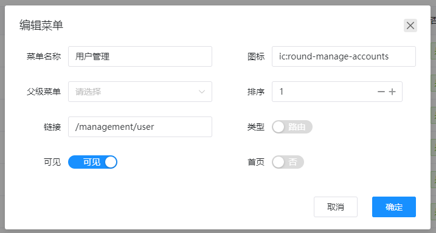
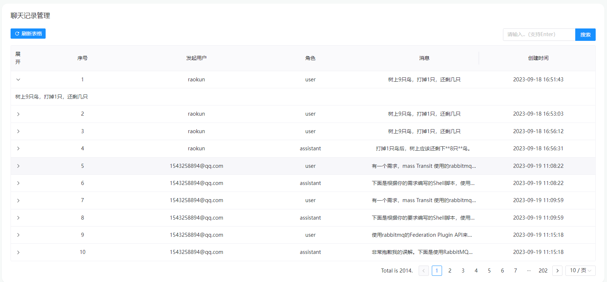
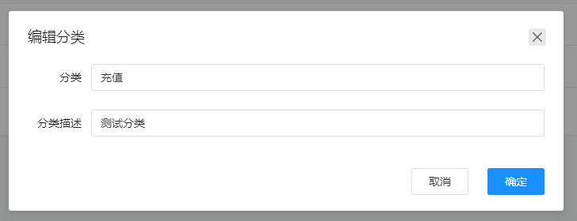
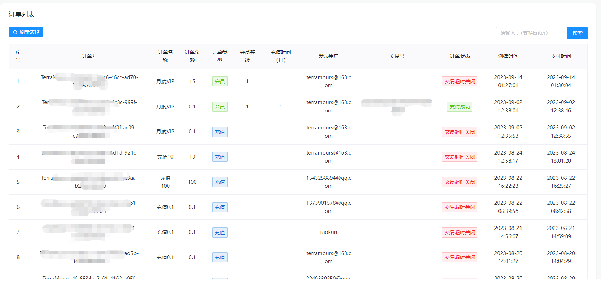
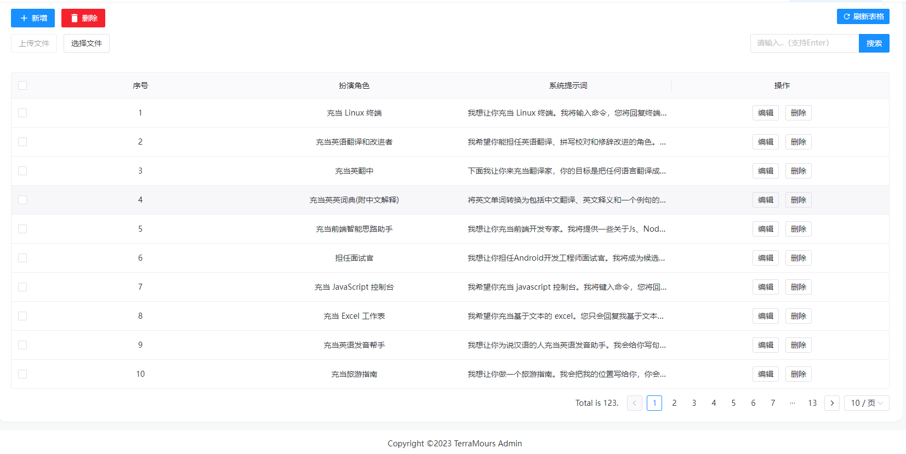

# 管理系统功能介绍

## 介绍
AI管理系统，TerraMours实战项目，实现用户登陆和基于SK的多语言模型聊天、基于chatgpt和SD的多模型图片生成等功能。管理端实现数据看板、聊天记录管理，图片记录管理、用户管理、系统配置等。

TerraMours Admin 是基于soybean-admin 开发完善的后台管理系统，技术包括 Vue3、Vite3、TypeScript、NaiveUI、Pinia 和 UnoCSS 等最新流行的前端技术栈，内置丰富的主题配置，有着极高的代码规范，开箱即用，也可用于学习参考。

## 1.数据看板

展示了多重数据统计，包含管理人员最关心的几种数据类型。

图表展示多维度的聊天和画图数量的统计，分为三个维度：当天（按小时分段统计），按天统计和按月统计。以下是按天统计的数据内容

## 2.系统设置

### 1.邮件服务配置

配置系统邮件的api服务参数，用于邮件验证码发送。

对应参数请在对应邮箱配置中获取

### 2.GPT设置

配置GPT的代理地址，gpt的定价方案，接口参数，已经KEY池配置等。

- 代理配置分为普通调用代理和GPT4的代理，因为目前GPT4的审核条件比较高，可以单独配置GPT4的接口方案
- MaxTokens  设置接口回复的最大值，请根据项目需求酌情设置
- 上下文数量   设置用户使用上下文时默认的上下文数量
- 最大提问数量   设置用户每日最大可提问的次数，不建议为空，可以防止恶意使用
- key池设置   设置普通调用时使用的key，多个key组成的key池可以保证项目GPT调用的效率更高

### 3.图片服务地址

- 静态文件地址  设置生成图片的访问url
- 图片定价    
- stable diffusion 配置  配置stable diffusion 模型类型 ，api接口地址 ，反向描述词等

## 3.菜单管理

后台管理系统实现菜单的动态配置，通过菜单管理界面设置菜单，后端API在初始化时会加入基本的菜单。

### 1.列表

### 2.新增/修改

* 菜单名称
* 图标
* 父级菜单   选择父级后默认为第二级菜单，不选默认为一级菜单
* 排序
* 类型    路由/外链
* 链接    1.路由类型为 页面对应的相对路径2.外链类型 为页面对应的url地址
* 可见   控制页面是否显示
* 首页   控制页面是否为系统首次加载时显示的页面  

## 4.角色管理

后台管理系统的角色控制。默认创建超级管理员角色，普通用户角色。

### 1.列表

### 2.设置权限

点击设置权限按钮，右侧会弹出当前系统配置的显示的菜单，对应项勾选控制当前角色的菜单查看权限。

## 5.用户管理

管理系统中注册的用户

### 1.列表

快速查看用户信息和用户的状态

### 2.新增/编辑

完成用户的信息修改

**注意**： 管理系统中新增用户的默认角色和初始密码请在API配置文件中的Initial的InitialRoleId和InitialPassWord配置。

## 6.聊天记录

查看系统中的聊天记录

点击展开可以查看完整的消息内容

## 7.图片记录管理

查看系统中图片的生成记录

点击展开可以查看对应图片内容

点击公开，可在图片广场中看见。

## 8.商品管理-商品分类

设置商品的类型，归类等信息，方便商品管理

### 1.列表

### 2.编辑

## 9.商品管理-商品列表

### 1.列表

### 2.新增/编辑

根据不同的充值类型填写不同的参数。

## 10.订单列表

查看用户购买的订单和支付情况，收益统计可以在数据看板中查看

## 12.敏感词管理

用于设置聊天提问的敏感词，避免用户提问一些敏感问题提起的项目问题

### 1.列表

### 2.文件导入

选择文件上传，可以快速批量导入敏感词库

模板文件地址：[模板文件](/files/terramours_sensitive.txt)

## 11.系统提示词

用于设置聊天提问的系统提示词，方便用户使用

### 1.列表

### 2.文件导入

选择文件上传，可以快速批量导入系统提示词

模板文件地址：[模板文件](/files/terramours_systemmessage.json)
